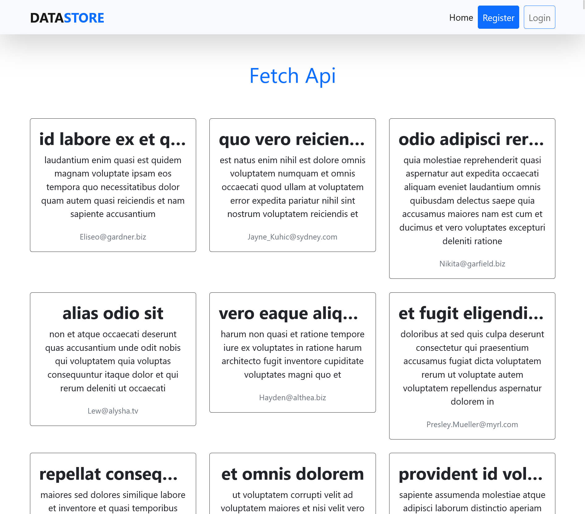
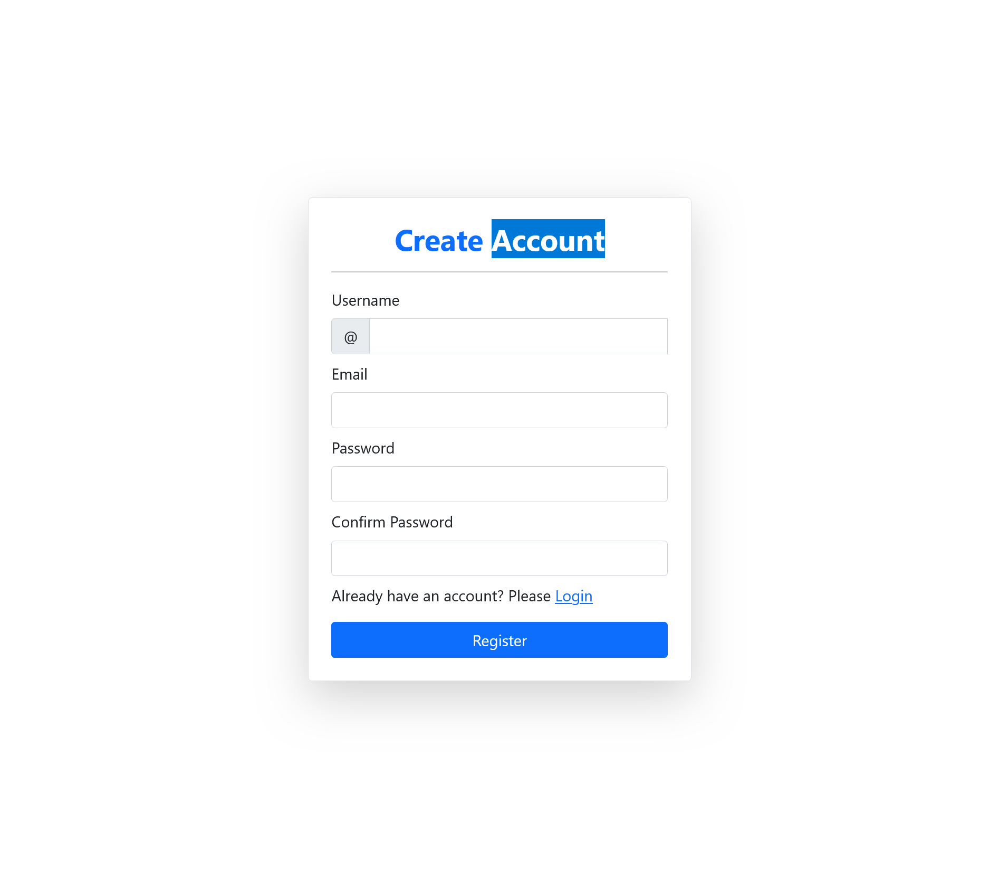
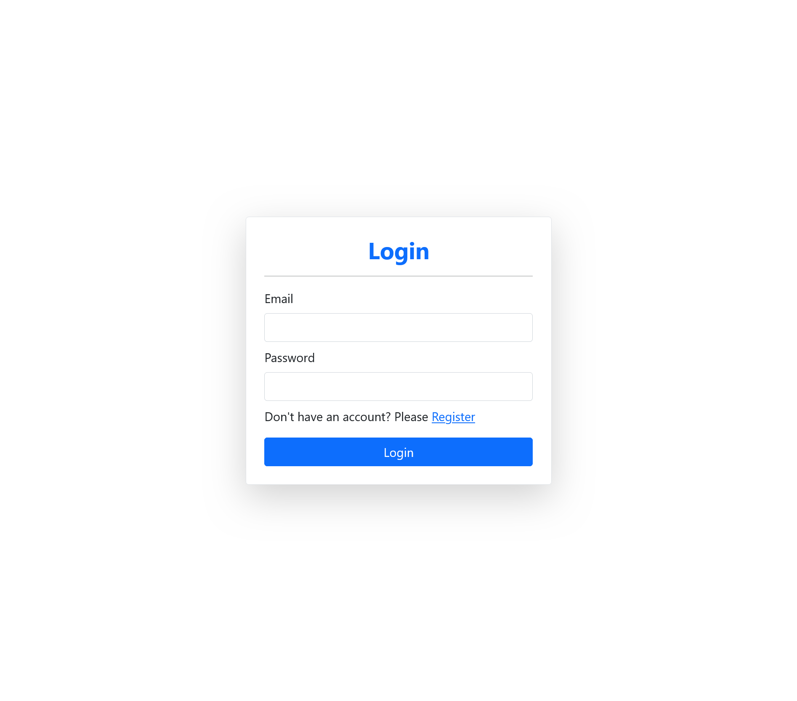

# Fetch API Project

## Overview

This project is part of my frontend internship at Senchola University. It utilizes HTML, CSS, JavaScript, and Bootstrap 5 to create a web application that fetches and displays data from the [JSONPlaceholder API](https://jsonplaceholder.typicode.com/comments). The project also includes form validation.

## Features

- Fetches data from the JSONPlaceholder API.
- Displays data using HTML, CSS,JS and Bootstrap 5.
- Implements form validation.

## Demo

Check out the [Live Demo](https://mibenin.github.io/fetch_api_task/index.html) to see the project in action.

## Screenshots







## Getting Started

1. Clone the repository:

   ```bash
   git clone https://github.com/MIBENIN/fetch_api_task.git
   ```

2. Open the project in your preferred web browser.

3. Explore the fetched data and interact with the implemented form.

## Project Structure

- `index.html`: Main HTML file.
- `login.html`: Login Form HTML file.
- `register.html`: Register Form HTML file.
- `styles.css`: Stylesheet.
- `api.js`: JavaScript file for fetching data and displaying them.
- `login.js` : Javascript file for implementing login functionality
- `register.js` : Javascript file for implementing register functionality
